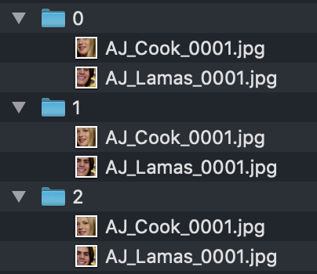

# A Convolutional Neural Network Cascade for Face Detection

This project is a re-implementation of the paper [A Convolutional Neural Network Cascade for Face Detection](https://www.cv-foundation.org/openaccess/content_cvpr_2015/papers/Li_A_Convolutional_Neural_2015_CVPR_paper.pdf) (Li et al., 2015) using Keras. The implementation is also highly influenced by [Gyeongsik Moon's re-implementation](https://github.com/mks0601/A-Convolutional-Neural-Network-Cascade-for-Face-Detection) of the paper in Tensorflow.

# Dataset

First, download the datasets:

- [Labeled Faces in the Wild](http://vis-www.cs.umass.edu/lfw/) (LFW) as positive training samples
- [Common Objects in Context](https://cocodataset.org/#download) (COCO) as negative training samples. Any COCO dataset split/version is fine.

- Place the LFW folder and COCO inside the [dataset/](../dataset/) folder. Rename each folder to 'LFW' and 'COCO' respectively so you don't have to change the parameters in the code.

Please note that the original paper uses AFLW dataset instead of the LFW dataset for training. This project uses LFW because it is not for comparison purposes. You could always change the dataset or use any other face dataset and apply data pre-processing according to the dataset's structure. Any 'non-face' dataset could also be used as the negative training samples instead of COCO.

# Data Preparation
**Note: Skip this phase if you use datasets other than LFW and COCO.**

## Detection Nets: Positive samples
The LFW dataset images contains backgrounds, i.e. they are not cropped tightly to the face area. Before feeding the images as training inputs to our detection nets, we must first crop them. The ground truth bounding box location for the face in all of the images is (83, 92) for top-left and (166,175) for bottom-right [(Sanderson and Lovell, 2009)](https://conradsanderson.id.au/lfwcrop/).

In the command line, run:

```bash
python preprocess.py detection_faces
```

running this command will save the face images in [dataset/faces](../dataset/faces/) folder


## Calibration Nets: Positive samples

For training the calibration nets, the images from the LFW dataset are first perturbed following the pre-determined 45 patterns of scaling and offsets.

In the command line, run:

```bash
python preprocess.py calibration_faces
```

running this command will create 45 sub-folders in [dataset/calib/](../dataset/calib/) folder, named based on the pattern id (0, 1, ..., 44). Then it writes the perturbed face images in these folders.

Here is a preview of the pre-processing result:



## Negative samples

The COCO dataset contains images of different dimensions. We prepare these images by cropping to square images.

```bash
python preprocess.py nonfaces
```

# Training
In this project, all of the CNN models are trained using Stochastic Gradient Descent (SGD) with standard back propagation on the LFW dataset. 

## Calibration Nets
The calibration nets should be trained first before detection nets (because we use the calibration nets in hard negative mining).

### **12-calibnet:**
```bash
python calibration.py train_calib 12
```

### **24-calibnet:**
```bash
python calibration.py train_calib 24
```

### **48-calibnet:**
```bash
python calibration.py train_calib 48
```

## Detection Nets
The three detection nets, 12-net, 24-net, and 48-net should be trained in the cascade manner. After training, the .h5 model will be saved in '[detection/model/](../detection/model/) folder and the model training history in '[detection/history/](../detection/history/) folder. After training each detection net, hard negative mining should be run to obtain the negative training samples for the subsequent models. 

### **12-net:**
```bash
python detection.py train_12net
```

### **24-net:**
```bash
python detection.py train_24net
```

### **48-net:**
```bash
python detection.py train_48net
```

# Hard Negative Mining

Hard negative mining is used to create more discriminative detection net models. Instead of using just 'some negative training samples', we use ***false positive*** images detected by the first net models (12-net and 24-net) to train the subsequent models (24-net and 48-net) in the cascade.

### **Hard negative mining for 24-net:**
Run this before training 24-net model:

```bash
python hard_neg_mining.py run 24
```
Saves hard negative mined images in [dataset/hard negative/24/](..dataset/hard\ negative/24/) folder

### **Hard negative mining for 48-net:**
Run this before training 48-net model:
```bash
python hard_neg_mining.py run 48
```
Saves hard negative mined images in [dataset/hard negative/48/](..dataset/hard\ negative/48/) folder

# References

Huang, G. B., Ramesh, M., Berg, T., and Learned-Miller, E., 2007, Labeled Faces in the Wild: A Database for Studying Face Recognition in Unconstrained Environments. Technical Report 07-49, October. University of Massachusetts, Amherst.

Li, H., Lin, Z., Shen, X., Brandt, J., Hua, G., 2015, ’A Convolutional Neural Network Cascade for Face Detection’, Proceedings of the IEEE Conference on Computer Vision and Pattern Recognition. CVPR, pp. 5325-34.

Lin, T., Maire, M., Belongie, S.J., Hays, J., Perona, P., Ramanan, D., Dollár, P., Zitnick, C.L., 2014, ’Microsoft COCO: Common Objects in Context’, European Conference on Computer Vision, pp. 740-755. Springer, Cham.


https://github.com/mks0601/A-Convolutional-Neural-Network-Cascade-for-Face-Detection